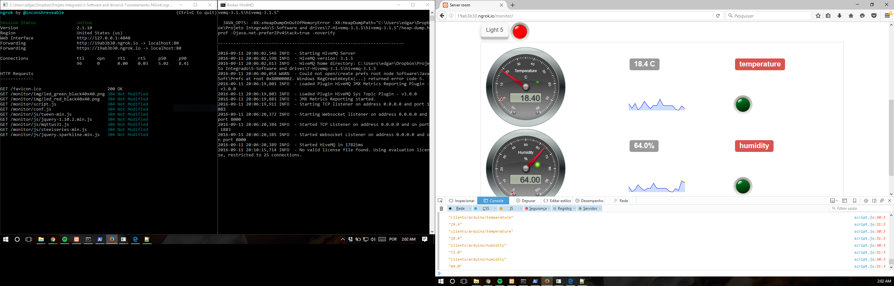

# tempmonitor

+A simple web interface which subscribes to an MQTT topic branch to display the information from a temperature and humidity sensors and buttons commands.

The screenshot shows an example:



The sensor is an Arduino which publishes a `1` when it comes online to the topic:

```
clients/arduino/
```

and which otherwise publishes an integer to the

```
clients/arduino/temperature 26
clients/arduino/humidity 50
```

topics.

The brunt of the work (design, layout, etc.) was based from [mqtt-panel](https://github.com/fabaff/mqtt-panel), [temp-monitor](https://github.com/jpmens/tempmonitor).

